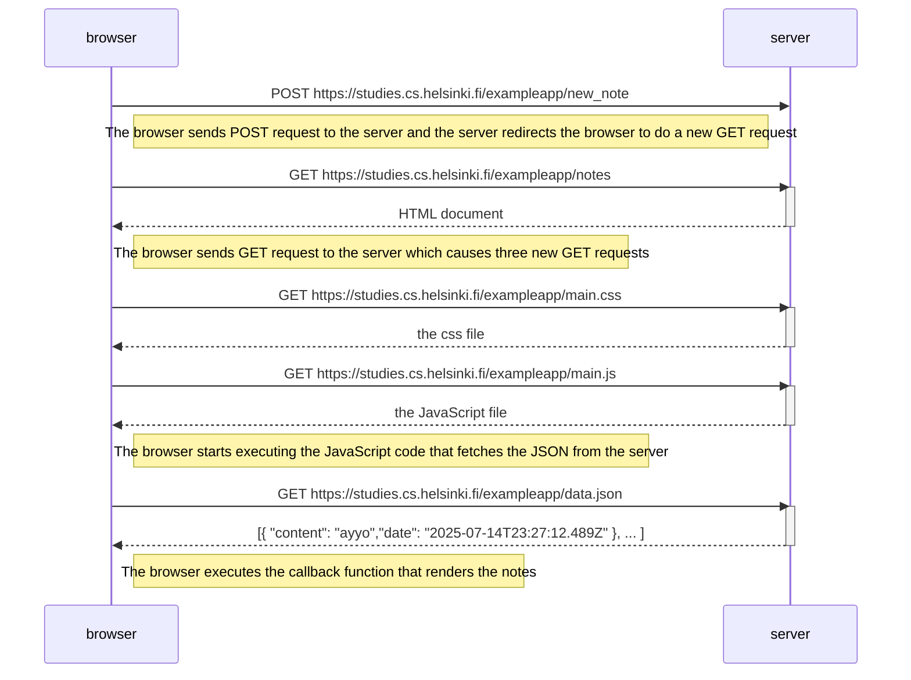

Sekvenssikaavio

```mermaid
  sequenceDiagram
      participant browser
      participant server
      
      browser->>server: POST https://studies.cs.helsinki.fi/exampleapp/new_note

      Note right of browser: The browser sends POST request to the server and the server redirects the browser to do a new GET request

      browser->>server: GET https://studies.cs.helsinki.fi/exampleapp/notes
      activate server
      server-->>browser: HTML document
      deactivate server

      Note right of browser: The browser sends GET request to the server which causes three new GET requests
      
      browser->>server: GET https://studies.cs.helsinki.fi/exampleapp/main.css
      activate server
      server-->>browser: the css file
      deactivate server
      
      browser->>server: GET https://studies.cs.helsinki.fi/exampleapp/main.js
      activate server
      server-->>browser: the JavaScript file
      deactivate server
      
      Note right of browser: The browser starts executing the JavaScript code that fetches the JSON from the server
      
      browser->>server: GET https://studies.cs.helsinki.fi/exampleapp/data.json
      activate server
      server-->>browser: [{ "content": "ayyo","date": "2025-07-14T23:27:12.489Z" }, ... ]
      deactivate server    
  
      Note right of browser: The browser executes the callback function that renders the notes
```
