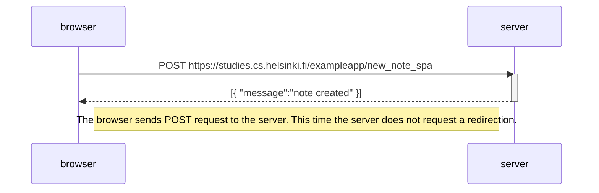

## Tehtävä 0.6: Uusi muistiinpano - Sekvenssikaavio

```mermaid
  sequenceDiagram
      participant browser
      participant server
      
      browser->>server: POST https://studies.cs.helsinki.fi/exampleapp/new_note_spa

      activate server
      server-->>browser: [{ "message":"note created" }]
      deactivate server

      Note right of browser: The browser sends POST request to the server. This time the server does not request a redirection.
```
